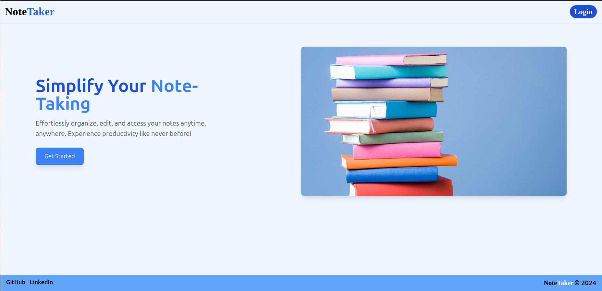
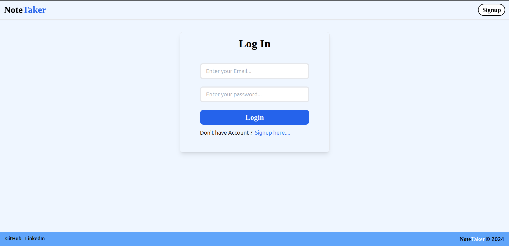

# NoteTaker

## Introduction

This is a full-stack **Note Taking Application** built with the **MERN stack** (MongoDB, Express.js, React.js, Node.js). The application allows users to create, edit, and delete notes seamlessly. 

### Key Features:
- User authentication (secure login and registration).
- Create, edit, and delete personal notes.
- Responsive UI for all devices.
- API endpoints secured with JWT.

This project is ideal for anyone looking to quickly jot down and organize their thoughts or ideas in a single place.

## Technologies Used

- Frontend: **React.js**, **Zustand**, **Tailwind CSS**, **Tanstack React query**
- Backend: **Node.js**, **Express.js**
- Database: **MongoDB**
- ORM - **Mongoose**
- Authentication: **JWT (JSON Web Tokens)**

## Getting Started

Follow these steps to run the application locally on your machine.
- git clone [https://github.com/Psmore/NoteTaker.git](https://github.com/Psmore/NoteTaker.git)
- cd NoteTaker
- npm run build
- npm run start

## Environment Variables

To run this project, you need to set the following environment variables in a `.env` file:

### Backend (.env)
- `DB_URL`: MongoDB connection string.
- `ACCESS_TOKEN_SECRET`: Secret key for JWT authentication.
- `ACCESS_TOKEN_EXPIRY`: Expiry for JWT cookies
- `PORT`: Port number for the backend server.

## Images 

### Home page

### Login page

